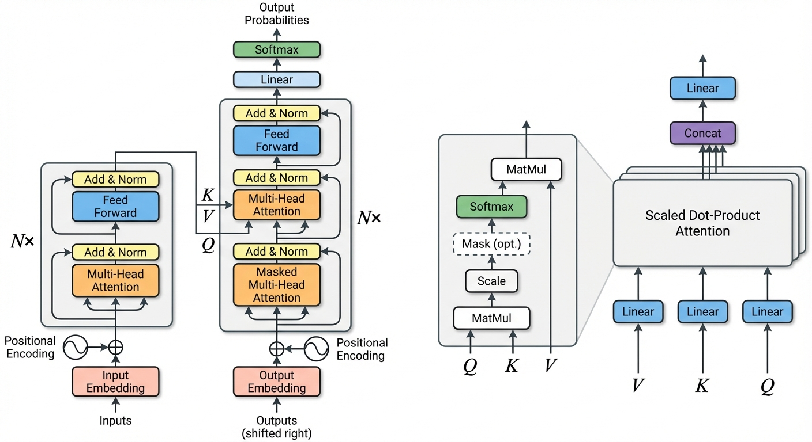
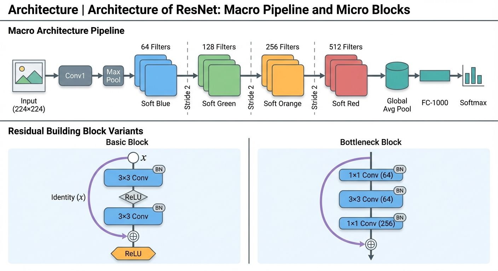
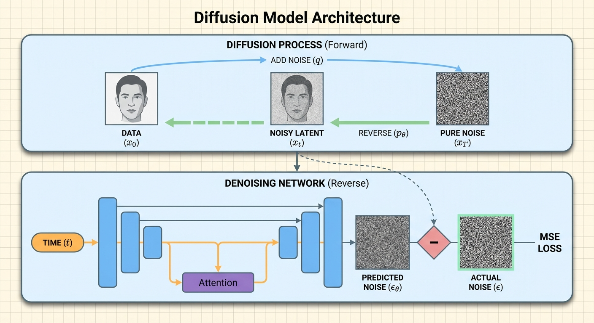

# 🍌 PaperBanana

Implementation of the **PaperBanana** framework from ["PaperBanana: Automating Academic Illustration for AI Scientists"](hhttps://arxiv.org/abs/2601.23265) (Zhu et al., 2025).

> An agentic framework that turns methodology text into publication-ready architecture diagrams — no Figma, no TikZ, no tears.

## Examples

All images below were generated end-to-end by PaperBanana (3 refinement iterations each, using the NeurIPS 2025 spotlight reference set).

### Transformer — *Attention Is All You Need* (Vaswani et al., 2017)

<p align="center">
  
</p>

### ResNet — *Deep Residual Learning* (He et al., 2016)

<p align="center">
  
</p>

### DDPM — *Denoising Diffusion Probabilistic Models* (Ho et al., 2020)

<p align="center">
  
</p>

---

## How It Works

PaperBanana orchestrates **five specialized agents** in an iterative pipeline:

```
Methodology Text + Caption
        │
        ▼
  ┌─────────────┐
  │  Retriever   │  → Finds relevant reference diagrams (from 100 NeurIPS examples)
  └──────┬──────┘
         ▼
  ┌─────────────┐
  │   Planner    │  → Translates methodology into a detailed visual description
  └──────┬──────┘
         ▼
  ┌─────────────┐
  │   Stylist    │  → Applies academic aesthetic guidelines
  └──────┬──────┘
         ▼
  ┌─────────────┐
  │  Visualizer  │  → Generates the image (Gemini image generation)
  └──────┬──────┘
         ▼
  ┌─────────────┐
  │   Critic     │  → Evaluates & provides feedback → loops back to Planner
  └─────────────┘
```

## Installation

```bash
pip install -r requirements.txt
```

Or with [uv](https://docs.astral.sh/uv/):

```bash
uv sync
```

## Setup

Create a `.env` file with your Gemini API key:

```
GEMINI_API_KEY=your-api-key-here
```

## Quick Start

```python
from paperbanana import generate_illustration
from load_reference_set import load_reference_set

# Load 100 curated NeurIPS 2025 architecture diagrams
ref_set = load_reference_set()

methodology = """
Our model uses a Vision Transformer backbone to extract patch embeddings,
followed by a cross-attention module that fuses text and image features.
The fused representation is decoded by a lightweight MLP head for classification.
"""

result = generate_illustration(
    methodology_text=methodology,
    caption="Architecture of our proposed vision-language fusion model",
    reference_set=ref_set,
    output_path="output/my_diagram",
)

print(f"Generated: {result['final_image_path']}")
```

### Advanced Usage

```python
from paperbanana import PaperBanana
from load_reference_set import load_reference_set

pb = PaperBanana(
    reference_set=load_reference_set(),
    mode="diagram",       # or "plot" for statistical plots
    max_iterations=3,
)

result = pb.generate(
    methodology_text=methodology,
    caption=caption,
    output_path="output/diagram",
)

# Save full generation history for analysis
pb.save_history("output/history.json")
```

## Project Structure

```
paperbanana/
├── paperbanana.py            # Main orchestration
├── config.py                 # API keys & model config
├── aesthetic_guidelines.py   # NeurIPS-style visual guidelines
├── utils.py                  # Shared utilities
├── load_reference_set.py     # Load reference set for RetrieverAgent
├── examples.py               # Runnable examples
├── agents/
│   ├── retriever.py          # Retriever Agent  (VLM-based ranking)
│   ├── planner.py            # Planner Agent    (methodology → description)
│   ├── stylist.py            # Stylist Agent    (aesthetic refinement)
│   ├── visualizer.py         # Visualizer Agent (image generation)
│   └── critic.py             # Critic Agent     (evaluate & feedback)
├── data/
│   ├── spotlight_reference_set.json      # 100 curated architecture diagrams
│   └── spotlight_reference_images/       # Corresponding images
├── examples/                 # Generated output images
│   └── readme/               # Showcase examples shown above
├── pyproject.toml
├── requirements.txt
└── README.md
```

## Reference Set

The Retriever Agent draws from **100 top-quality architecture diagrams** curated from NeurIPS 2025 Spotlight papers:

- **685** spotlight papers parsed with [MinerU](https://github.com/opendatalab/MinerU) on [Modal](https://modal.com) (50× A10G GPUs)
- **1,732** methodology-section images extracted via section-aware filtering
- **321** verified architecture diagrams after 2-pass Gemini classification (caption + visual)
- **100** final diagrams selected by quality ranking (all scored 10/10)

## Configuration

Edit `config.py`:

| Setting | Default | Description |
|---------|---------|-------------|
| `VLM_MODEL` | `gemini-3-pro-preview` | Reasoning model (Retriever, Planner, Stylist, Critic) |
| `IMAGE_MODEL` | `gemini-3-pro-image-preview` | Image generation model (Visualizer) |
| `MAX_REFINEMENT_ITERATIONS` | `3` | Planner↔Critic loop iterations |
| `NUM_REFERENCE_EXAMPLES` | `10` | References retrieved per generation |

## Paper

```bibtex
@article{zhu2025paperbanana,
  title={PaperBanana: Automating Academic Illustration for AI Scientists},
  author={Zhu, Dawei and Meng, Rui and Song, Yale and Wei, Xiyu and Li, Sujian and Pfister, Tomas and Yoon, Jinsung},
  journal={NeurIPS},
  year={2025}
}
```

## License

This implementation is for research and educational purposes.
